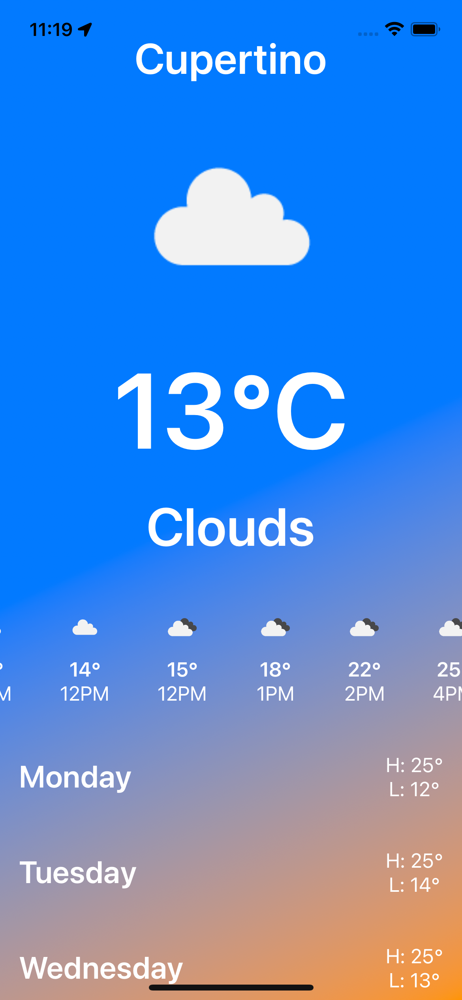

# About The Weather


A single-screen weather app written in Swift/SwiftUI that follows a Model-View-ViewModel (MVVM) architecture, 
which helps maintain separation of concerns and ensures a clean and scalable codebase. <br> <br>
 
## Here's an overview of the architecture

1. Model:<br>
**API Data Model** : Represents the structure of weather data, including properties like temperature, humidity, wind speed, weather conditions, etc. This model is used to decode data from the weather API. <br>

2. ViewModel:<br>
**WeatherViewModel** : Acts as an intermediary between the Model and View layers. Also responsible for making API requests to fetch weather data from the weather service provider  OpenWeatherMap and formats it for presentation.<br></br>
**LocationViewModel**: Manages location services, retrieving the user's current location and passing it to the WeatherViewModel for weather data retrieval. <br>

3. View:<br>
**ContentView** : This is the main SwiftUI view that presents the weather information to the user.</br>
**Subcomponents** : SwiftUI Views

4. Service:<br>
**Location Service** : Interacts with the device's location services to fetch the user's current location.</br>

5. Common:<br>
This contains reauseble tools shared app wise, like extensions, helper functions, etc.</br>

5. Network:<br>
This contains the endpoint used to call the open weather API, the configuable parameter and the APIKey.</br>

## Usage
Yuo need to get your API key from [](https://openweathermap.org/api) 
<br><br>
The API key you will have to be inserted in the [endpoint](https://github.com/salvatop/AboutTheWeather/blob/main/AboutTheWeather/Network/Endpoint.swift)
</br>
```Swift
enum Endpoint {
    ..
    private var apiKey: String { return "&appid=YOURKEY" }
    ..
```
</br>

## How the App looks like?

<p align="center">
  
</p>
